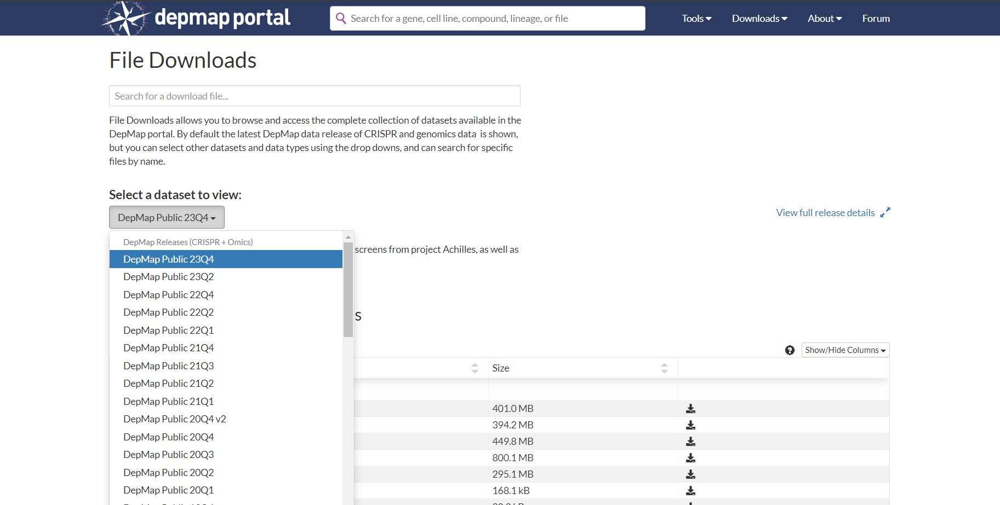

<h2> 003 - Interactive Kaplan-Meier plotter </h2>

 Expand this to read more...

    

        

            
<strong> Summary </strong>

            
 During my graduate studies, I helped two bachelor's students working in my research group to do a small 
                project analyzing survival data from a breast cancer clinical trial. The aim was to evaluate a possible association between 
                low <strong>gene expression</strong> of two genes at once with <strong>increased patient survival</strong>.   
                For this purpose, we retrieved data publicly available in <strong><a href="https://www.cbioportal.org/">cBioPortal</a></strong>, 
                and generated <strong>Kaplan-Meier survival curves</strong>. We focused on the <strong>METABRIC</strong> dataset containing 
                information for over <strong>2,500 patients</strong> and I generated tools in <strong>Jupyter/Colab notebooks</strong> and a 
                <strong>Streamlit app (see GIF -->)</strong>) to automate the creation of these plots with <strong>Python</strong>.   
                At the end of the project, we were able to identify <strong><10 gene pairs</strong> showing the behavior of interest. That 
                information was used in combination with other data from different techniques (in-silico and wet-lab) to prioritize further 
                studies evaluating the effect of inhibtion of those genes in cancer cell models.
            

        

        

            <video width="100%" height="auto" autoplay loop muted><source src="Images_GIFs_Videos/Preview_003.mp4" type="video/mp4"></video> 
        

    

    

    

        

                
<strong> Problem </strong>

                <ul>
                    <li class="justify-text">We needed to generate around <strong>100 Kaplan-Meier plots</strong> (pairs of <strong>RET-other gene
                                            </strong>). </li>
                    <li class="justify-text">Each plot required to divide the dataset into <strong>4 groups</strong> to generate <strong>4 survival 
                                            curves</strong> (expression: <strong>low-low, low-high, high-low, high-high</strong>). </li>
                    <li class="justify-text">The clinical data (<strong>survival times and status</strong>) and the RNA Seq expression data were in
                                            different datasets with different structure, so pre-processing to both was required before we could map 
                                            the patient IDs. </li>
                    <li class="justify-text">We needed to screen all the plots generated but keep only the ones where the <strong>low-low curve</strong>
                                            was higher than the others, and retrieve relevant data such as <strong>CIs and time to 50% survival</strong> 
                                            to complement our analysis. </li>
                    <li class="justify-text">Since each clinical trial reports the data in a different way and not all have RNA Seq data, we chose the 
                                            best possible option for breast cancer (<strong><a href="https://www.cbioportal.org/study/summary?id=brca_metabric">METABRIC</a></strong>). </li> 
                    <li class="justify-text">In order to reuse our code for other breast cancer datasets or even different cancer types, we needed to 
                                            generalize the workflow as much as possible and make tools for reproducibility and automation. </li>
                </ul>
        

        

            
<strong> Solution </strong>

            <ul> 
                <li class="justify-text">I learned how to use the <strong>KaplanMeierFitter</strong> module from the <strong>lifelines</strong> python 
                                        library to generate KM plots. </li>
                <li class="justify-text">I first generated a <strong>Google Colab notebook</strong> that was dataset-specific to produce batches of 
                                        <strong>40-50</strong> plots. This exclusively makes 4 groups from the original dataset based on RET and one 
                                        other gene, which required manual editing of the code to write down all 40-50 names of genes (<a href="https://user-images.githubusercontent.com/62916582/204424020-bae3613c-bf10-4a3b-9d50-beaf50ca8eee.gif" target="_blank">View tool</a>). </li>
                <li class="justify-text">Then, I found a way to generalize some steps and created a <strong>Jupyter notebook</strong> that used
                                        <strong>ipywidgets</strong> to interactively get user inputs, allowing dynamic selection of any columns
                                        to divide the dataset into 2 or more groups and re-plotting curves (<a href="https://github.com/EdRey05/Resources_for_Mulligan_Lab/blob/de82796fe821b96c18ab0709018c02c3b02aba92/Tutorials/Preview_Interactive_KM.gif" target="_blank">View tool</a>). </li>
                <li class="justify-text">Finally, I discovered <strong>Streamlit</strong> and adapted my interactive notebook to a data app (GIF above)
                                        that used a similar code approach but with more interactivy, improved outputs and better user experience. </li>
                <li class="justify-text">Although the app works for several different datasets, I noticed high variability in the formatting of clinical
                                        trial data, and constantly try to improve the app to generalize it more.
            </ul>
        

    

    
<strong> Read the instructions and watch another demo of the Streamlit app here: <a href="https://github.com/EdRey05/Streamlit_projects/tree/main/003_KM_plotter">Demo_KM_plotter</a></strong>

<h2> 002 - Automated Power Point generator</h2>

 Expand this to read more...

    

        

            
<strong> Summary </strong>

            
 During my graduate studies, I performed numerous microscopy experiments. These experiments required to acquire sufficient
                                    images (of cancer cells), process them and analyze them. When I was setting up a new technique in our research group
                                    called <strong>Proximity Ligation Assay - PLA</strong> to evaluate protein-protein interactions, I was able to use a 
                                    cell imager (EVOS M7000 - Thermo Fisher) that has automation capabilities. I automated the acquisition of hundreds of 
                                    fields of view (big images with many cells), and wrote scripts in <code>Jython</code> (Python wrapper for Java) to 
                                    automate the image pre-processing and analysis in <strong>ImageJ/Fiji</strong>. The final output of my series of scripts
                                    was a csv file with the quantification result for each image of individual cells (big images where cropped into many 
                                    smaller). Also, to validate the quantification results I designed a tool to merge all outputs into a summary Power Point
                                    presentation. I was able to automate the creation of slides, define the layout and the items to insert into each slide
                                    by using the <code>python-pptx</code> library. I created a tool in Jupyter/Colab notebook version and then a Streamilt 
                                    app that does the exact same thing but provides a better user interface and additional information. 
            

        

        

            
        

    

    
<strong> Problem </strong>

    
 Some description here 

    
<strong> Solution </strong>

    
 Some description here 

    

        

            
<strong> Sample cell images and figure </strong>

            
        

        

            
<strong> First tool </strong>

            
        

    

    
<strong> Read the instructions and watch another demo of the Streamlit app here: <a href="https://github.com/EdRey05/Streamlit_projects/tree/main/002_Automated_PPTX_PLA">Demo_PPTX_PLA</a></strong>

<h2> 001 - Extract RNA expression data from CCLE/DepMap </h2>

 Expand this to read more...

    

        

            
<strong> Summary </strong>

            
 Some summary here. 
            

        

        

            
        

    

    
<strong> Problem </strong>

    
 Some description here 

    
<strong> Solution </strong>

    
 Some description here 

    

        

            
<strong> DepMap website showing the constant updates to the datasets </strong>

            
        

        

            
<strong> First tool (used CCLE data from CBioPortals = DepMap 19Q1) </strong>

            
        

    

    
<strong> Read the instructions and watch another demo of the Streamlit app here: <a href="https://github.com/EdRey05/Streamlit_projects/tree/main/001_RNA_expression_DepMap">Demo_RNA_DepMap</a></strong>

<h2> Try out my apps with Github Codespaces! </h2>

 Expand this to read more...

    

        

            
 If you have a Github account you can create a Codespace with all the requirements to 
                run my apps. You only have to log into you account, click on the following button, create your Codespace (we 
                all have 60h of free usage per month!), and follow the instructions. 

            
        

        

            <video width="100%" height="auto" controls><source src="Images_GIFs_Videos/Demo_Codespaces.mp4" type="video/mp4"></video>
        

    

